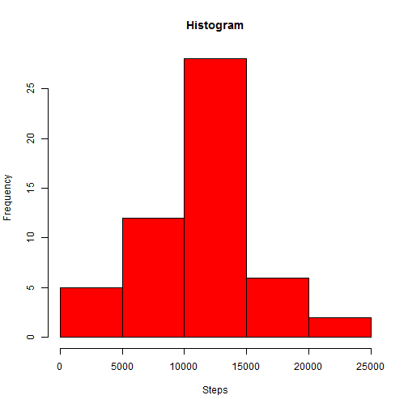
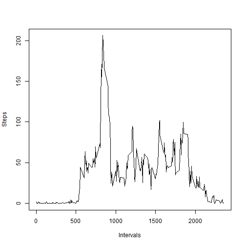
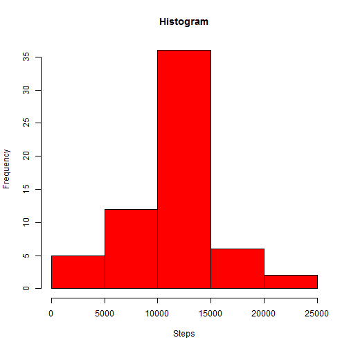
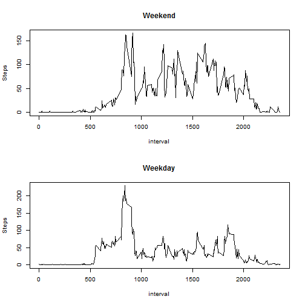

Assignment 1
====================================

Assignment 1 of Reproducible Research (Coursera)

##Loading and preprocessing the data

Loading the data. The dataset has to be in the working folder (root).


```r
act<- read.csv("./activity.csv")
```

##What is the mean total number of steps taken per day?
1. Calculate the total number of steps taken per day

```r
count_by_date <- aggregate(steps ~ date, act,sum)
head(count_by_date)
```

```
##         date steps
## 1 2012-10-02   126
## 2 2012-10-03 11352
## 3 2012-10-04 12116
## 4 2012-10-05 13294
## 5 2012-10-06 15420
## 6 2012-10-07 11015
```
2.Make a histogram of the total number of steps taken each day

```r
hist(count_by_date$steps,xlab="Steps",main="Histogram",col="red")
```

 

3.Calculate and report the mean and median total number of steps taken per day


```r
mean(count_by_date$steps,na.rm = T)
```

```
## [1] 10766.19
```

```r
median(count_by_date$steps,na.rm = T)
```

```
## [1] 10765
```
**The mean total number of steps taken per day is 10766.19 and the median is 10765.**

##What is the average daily activity pattern?

1.Make a time series plot (i.e. type = "l") of the 5-minute interval (x-axis) and the average number of steps taken, averaged across all days (y-axis)


```r
dados <- aggregate(steps ~ interval, act,mean)
plot(dados$interval,dados$steps,type="l",xlab="Intervals",ylab="Steps")
```

 

2.Which 5-minute interval, on average across all the days in the dataset, contains the maximum number of steps?


```r
max<-with(dados, interval[which.max(steps)])
max
```

```
## [1] 835
```
**The 5-minute interval that contains the maximum number os steps is 835.**

##Imputing missing values

1.Calculate and report the total number of missing values in the dataset (i.e. the total number of rows with NAs)

```r
length(which(is.na(act$steps)))
```

```
## [1] 2304
```
**The total number of missing values in the dataset (i.e. the total number of rows with NAs) is 2304.**

2.Devise a strategy for filling in all of the missing values in the dataset.

**The strategy is demonstrated below**

3.Create a new dataset that is equal to the original dataset but with the missing data filled in.

I used the mean for the 5-minute intervals.


```r
for(i in 1:17568) {
        if(is.na(act$steps[i])) { 
                num<-act$interval[i]
                act$steps[i] <- mean(act$steps[act$interval==num], na.rm=T) 
        }  }
activity<-act
head(activity)
```

```
##       steps       date interval
## 1 1.7169811 2012-10-01        0
## 2 0.3396226 2012-10-01        5
## 3 0.1320755 2012-10-01       10
## 4 0.1509434 2012-10-01       15
## 5 0.0754717 2012-10-01       20
## 6 2.0943396 2012-10-01       25
```
4.Make a histogram of the total number of steps taken each day and Calculate and report the mean and median total number of steps taken per day. Do these values differ from the estimates from the first part of the assignment? What is the impact of imputing missing data on the estimates of the total daily number of steps?


```r
count_by_date2 <- aggregate(steps ~ date, activity,sum)
hist(count_by_date2$steps,xlab="Steps",main="Histogram",col="red")
```

 

```r
mean(count_by_date2$steps,na.rm = T)
```

```
## [1] 10766.19
```

```r
median(count_by_date2$steps,na.rm = T)
```

```
## [1] 10766.19
```

**The mean total number of steps taken per day is 10766.19 and median is 10766.19.**


**The shape of the histogram didn't change, just the frequency (y-axis). The mean and median didn't change much when compared with the data before filling in the NA data. In this case, the impact of imputing missing data no the estimates of the total daily number of steps is negligibly.**


##Are there differences in activity patterns between weekdays and weekends? Use the dataset with the filled-in missing values for this part.

1. Create a new factor variable in the dataset with two levels – “weekday” and “weekend” indicating whether a given date is a weekday or weekend day.


```r
Sys.setlocale("LC_ALL","English") # set in English
```

```
## [1] "LC_COLLATE=English_United States.1252;LC_CTYPE=English_United States.1252;LC_MONETARY=English_United States.1252;LC_NUMERIC=C;LC_TIME=English_United States.1252"
```

```r
activity$day <- weekdays(as.Date(activity$date)) #creating column with weeknames
```

Recoding to Weekday or Weekend using plyr package

```r
library(plyr)
activity$day<-mapvalues(activity$day, from = c("Monday","Tuesday","Wednesday","Thursday","Friday", "Saturday","Sunday"), to = c("Weekday", "Weekday","Weekday","Weekday","Weekday","Weekend","Weekend"))
```
2.Make a panel plot containing a time series plot (i.e. type = "l") of the 5-minute interval (x-axis) and the average number of steps taken, averaged across all weekday days or weekend days (y-axis).

Creating two datasets based upon the Weekend or Weekday

```r
activity_WE <- activity [ which (activity$day=='Weekend'),]
activity_WD <- activity [ which (activity$day=='Weekday'),]
#Calculating the mean steps by interval in each dataset
meanact_WE <- aggregate(steps ~ interval, activity_WE,mean)
meanact_WD <- aggregate(steps ~ interval, activity_WD,mean)
#Ploting
layout(matrix(c(1,2), 2, 2, byrow = F), 
       widths=c(3,3), heights=c(7,7))
plot(meanact_WE$interval,meanact_WE$steps,type="l",xlab="interval",ylab="Steps",main="Weekend") # Weekend
plot(meanact_WD$interval,meanact_WD$steps,type="l",xlab="interval",ylab="Steps",main="Weekday") # Weekday
```

 

```r
par(mfrow=c(1,1))
```

**The maximum of activity is higher on weekdays than on weekends. The highest peak of activity is on weekdays.**

**There are many "peaks" of activity during weekends, with sudden "stops" and sudden activity. So, this suggests more rest time (on weekends) after some activity.**

**During the weekend, the activity starts later when compared with weekdays. The activity on weekdays starts earlier and with sudden rise.**
